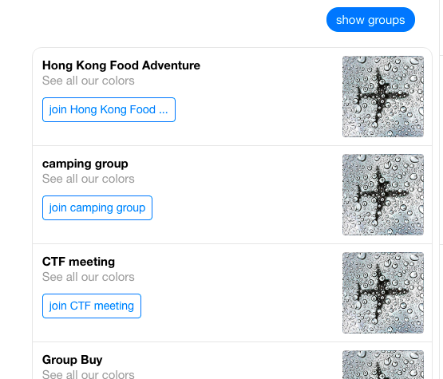

# Facebook Chat Bot Demo

This demo shows the manual integration with [Facebook Messenger](https://developers.facebook.com/) and 
[API.ai](https://console.api.ai) using webhook.

This bot allows you to create, join, or leave a group on Facebook Messenger. 

## Demo1: Create user
   

## Demo2: Create group
   

## Demo3: Show groups
   

# Usage
To use it, you'll have to open a server. (It's closed now. I used [ngrok](https://ngrok.com) to open one)  
Also, change the url in both facebook messenger and api.ai. (as shown below) 

## In [facebook_developer](https://developers.facebook.com):

## In api.ai:

